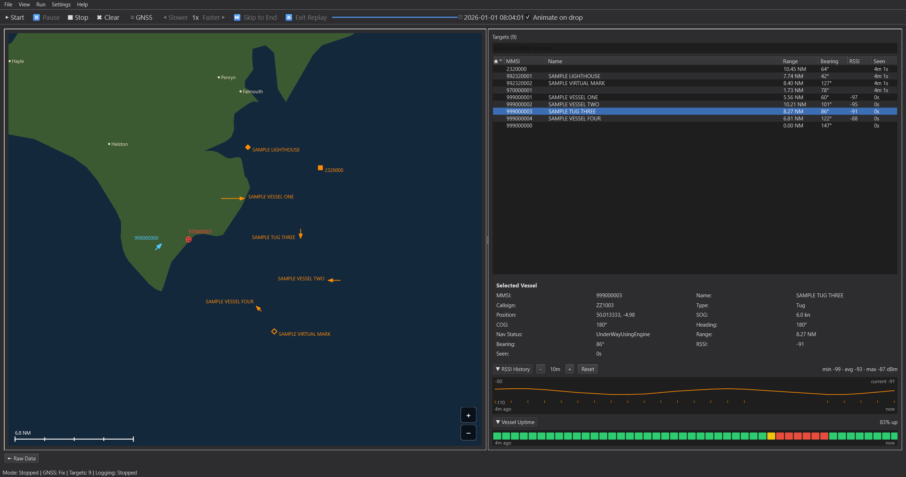

# AIS Monitor

A desktop AIS and GNSS monitoring tool for tracking vessels from a live serial receiver or an offline log replay, plotted on a lightweight offline coastline map.



## Status

Replay mode, mapping, and the target list are solid and covered by an automated test suite. Live serial mode has been validated against real AIS/GNSS receiver hardware, with no issues seen during testing.

## Features

- **Live mode**: reads AIS and GNSS sentences from serial receivers (configurable port, baud, and data/parity/stop bits per receiver), with an optional separate GNSS port.
- **Replay mode**: play back a recorded log at adjustable speed, or scrub to any point in the file with an animated "catch-up" preview of the preceding track history.
- **Session recording**: live sessions are automatically logged to disk in the same format replay reads, so a recorded session is itself replayable.
- **Offline coastline map**: pan/zoom map rendered from Natural Earth data (no internet connection or tile server required), with vessel markers, heading-oriented triangles, track history, and a nautical scale bar.
- **Target list**: sortable table of tracked vessels with range/bearing to your own position, pinning (survives Clear and sorts to the top), and per-column visibility.
- **Vessel detail panel**: MMSI, name, callsign, type, position, SOG/COG/heading, nav status, and more — every field is independently toggleable from the View menu.
- **RSSI tracking**: signal-strength correlation for compatible receiver hardware.
- **Distance units, themes**: nautical miles/km/miles, dark/light theme.

## Requirements

- Python 3.10 or newer (developed and tested with 3.12)
- Dependencies listed in `requirements.txt`: PySide6, pyserial, pyais, pynmea2, pyshp, pytest

## Download

Pre-built Windows and Linux builds are attached to each [Release](https://github.com/IWantItAll6/AIS-Monitor/releases) — no Python install required. Unzip/untar and run the `AISMonitor` executable; it's portable (settings and recordings are stored next to it, not system-wide).

## Setup (from source)

```bash
python -m venv .venv

# Windows
.venv\Scripts\activate
# Linux / macOS
source .venv/bin/activate

pip install -r requirements.txt
```

On Linux, if you plan to use live serial mode, your user typically needs to be in the `dialout` group to access serial devices:

```bash
sudo usermod -a -G dialout $USER
```
(log out and back in for it to take effect)

## Running

```bash
python main.py
```

No hardware needed to try it out — use **File > Load Sample Data** to load a bundled, fully synthetic replay log and press **Start**.

## Running the tests

```bash
pytest
```

Some tests are skipped automatically if you don't have private field-test logs in `resources/` (see `resources/README.md`) — that's expected on a fresh clone.

A handful of timing-sensitive tests are known to be flaky when the full suite runs back-to-back (they pass reliably on their own). For a fully reliable run — e.g. before a release — use:

```bash
python scripts/run_tests.py
```

This runs the main suite, then re-runs each `@pytest.mark.serial` test in its own fresh process afterward.

## Data sources

- Coastline, land, and populated-places data: [Natural Earth](https://www.naturalearthdata.com/) (public domain).
- UK town/city data: [GeoNames](https://www.geonames.org/) (CC BY 4.0).

## Contributing

Found a bug or have a feature request? Open an [issue](https://github.com/IWantItAll6/AIS-Monitor/issues) — there are templates for both.

## License

GPLv3 — see [LICENSE](LICENSE). Anyone can use, modify, and redistribute this software, but redistributed modified versions must also be released under the GPL.
